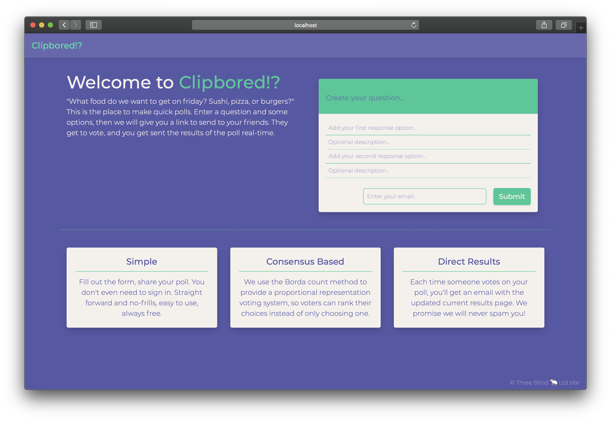
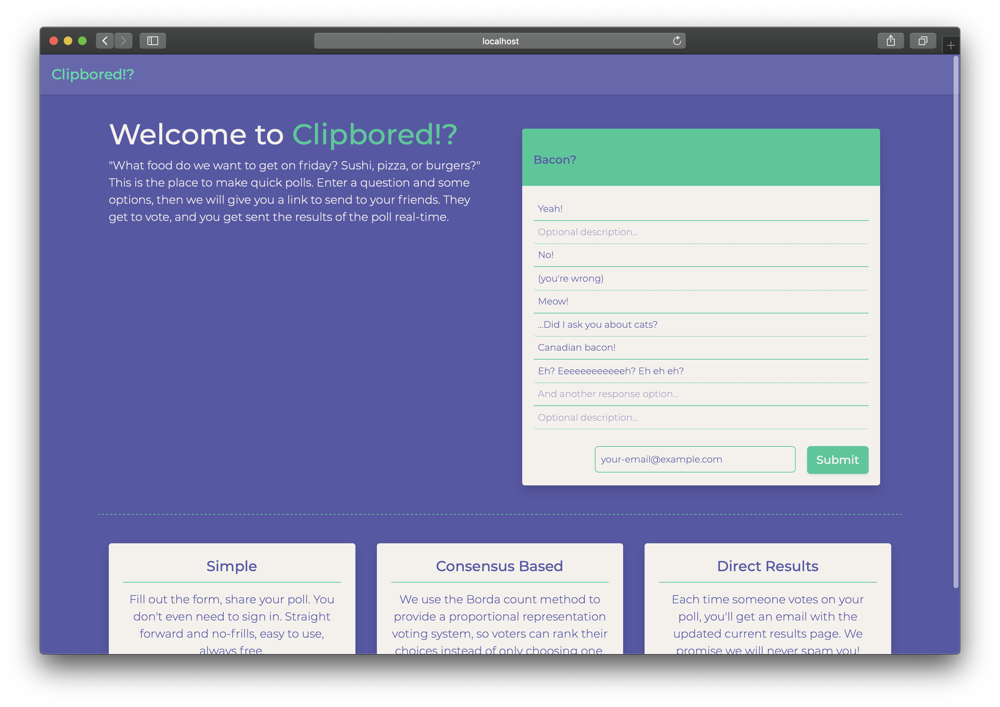
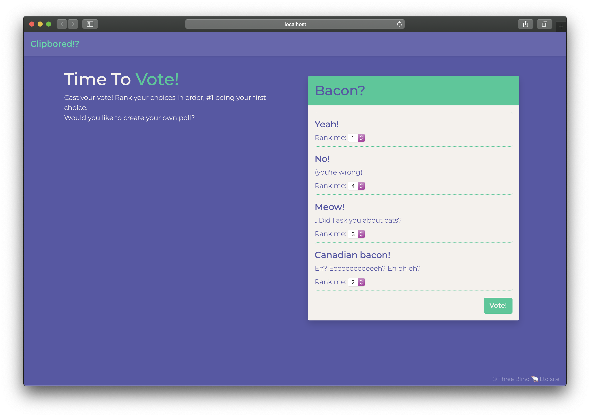
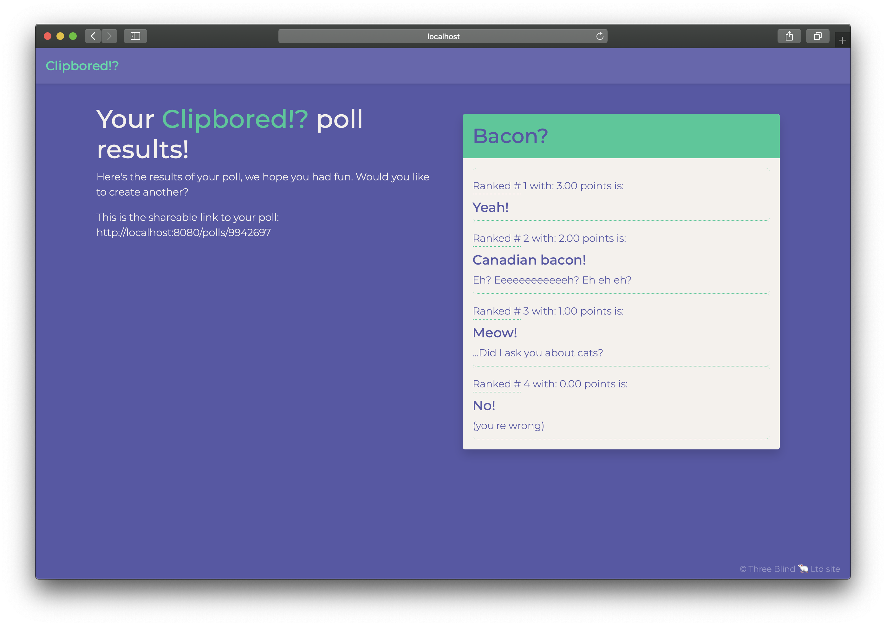

# Clipbored!? © Three Blind Mice Ltd site

Clipbored is a strawpoll esque poll creator, the first group project for the Lighthouse Labs web dev bootcamp. This is a full stack web app, using Node, ES6, Express, Knex and MongoDB in the back-end and bootstrap framework, SCSS, ES5, jQuery and AJAX front-end technologies.

*made by:* **[Ghabe Bossin](https://github.com/ringringlemurpants), [Joshua Dennis](https://github.com/floydianslips), [Sammy Lirette-Cowen](https://github.com/SammyLiretteCowen)**

## Features

- Auto expanding poll creation form
- Submission validation
- regularly updated results by email

## Examples

#### Getting Started

1. Fork this repository, then clone your fork of this repository.
2. Create the `.env` by using `.env.example` as a reference: `cp .env.example .env`
3. Update the .env file with your correct local information
4. Create the `.email-config.js` by using `.email-config.example` the same as above.
5. Install dependencies: `npm install`
6. Fix to binaries for sass: `npm rebuild node-sass`
7. Run migrations: `npm run knex migrate:latest`
  <!-- - Check the migrations folder to see what gets created in the DB -->
8. Run the seed: `npm run knex seed:run`
  <!-- - Check the seeds file to see what gets seeded in the DB -->
9. Run the server: `npm run local`
10. Visit `http://localhost:8080/` in your browser.

##### Dependencies

- Body-parser
- Bootstrap
- Dotenv
- Ejs
- Express
- Knex
- Knex-logger
- Mailgun-js
- Morgan
- Node
- Node-sass-middleware
- Pg
